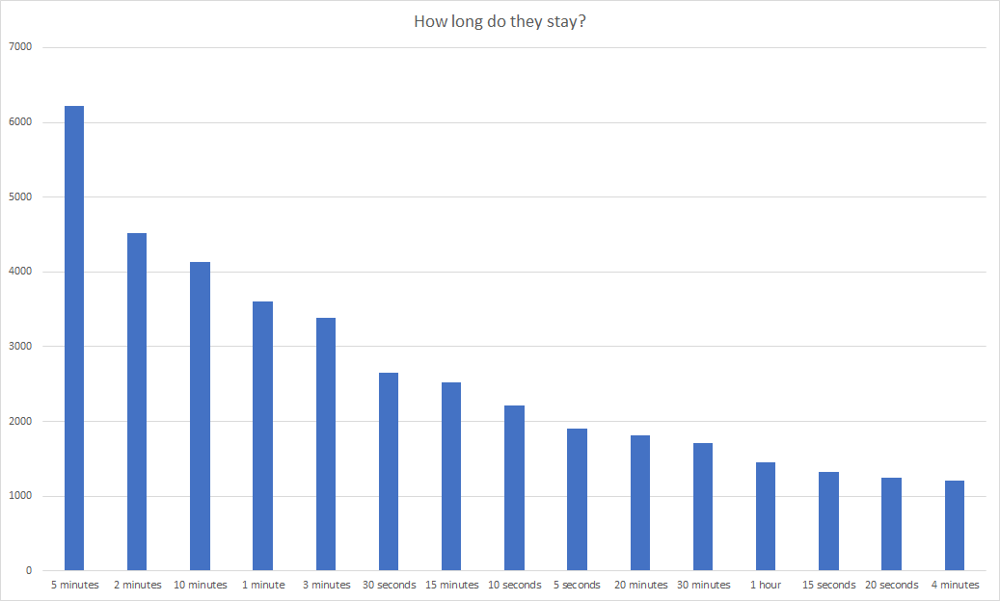

# Assignment 3: Spark - Option B: Data analysis

For this assignment, I have decided to perform an analysis on an open dataset.

The dataset that I chose for it is a UFO sighting dataset from [https://data.world/timothyrenner/ufo-sightings]

## Dataset 
### Description

This dataset is a cleaned up data scrape from the National UFO Reporting Center online database: http://www.nuforc.org/webreports.html

Each row in this database contains the following attributes:
1. **`summary`:** A trimmed version of the full report text.
2. **`city`:** The reported city of the sighting.
3. **`state`:** Reported state of the sighting.
4. **`date_time`:** Reported date and time of the sighting. 
5. **`shape`:** Reported shape of the UFO.
6. **`duration`:** Reported duration of the sighting.
7. **`stats`:** All statistics combined into one string.
8. **`report_link`:** Link to the report in the online database.
9. **`text`:** Full text of the sighting report.
10. **`posted`:** Date and time of the report.
11. **`city_latitude`:** Latitude of the reported city.
12. **`city_longitude`:** Longitude of the reported city.

### Cleanup

For my analyses, I do not need all of the attributes, so I filtered the dataset out and only left the interesting attributes in. So, I decided to remove:
1. **`summary`**, because this attribute provides the same information as **`text`**, but less and it is not an actual summary, just trimmed text from **`text`**.
2. **`stats`**, because it only contains all of the information from the other cells, but in one string.
3. **`report_link`**, as the link to the web page is not really useful in this case.
4. **`posted`**, because it is not that interesting when a report was posted.

```scala
val ufoDF = ufodata.drop("summary", "stats", "report_link", "posted")
```

## Analysis
### UFO shapes

First, let's see what are the most popular UFO shapes. This might give us insight into how many different alien cultures/civilisations we have been visited by :).

In order to do this, we need to group our data, based on this **`shape`** attribute:
```scala
val ufoShapes = ufoDF.groupBy("shape").count.cache()
```
Now, to get the 15 most popular ones, let's filter out `null`, `unknown` and `other` values (because they are not informative) and order the remaining ones by count:
```scala
val filterOutValues = List("null", "unknown", "other")
val ufoShapes_top = ufoShapes.filter(!$"shape".isin(filterOutValues:_*)).orderBy(desc("count")).limit(15)
```

These are the results:


Okay, seems like the aliens are not too original in their spacecraft design.

### UFO durations

Now, let's see how long they tend to stick around. Based on this observation, we can reason about their opinion about us.

```scala
val filterOutValues = List("null", "unknown")
val ufoDurations_top = ufoDurations.filter(!$"duration".isin(filterOutValues:_*)).orderBy(desc("count")).limit(15)
```

Here's the results:



Hmm... They don't seem to stick around for long... Seems like they are disappointed by what they find here.

But anyway, let's see which places they like to visit:

### UFO locations

To get the map of the reports, we first need to clean up the location data. Some of the fields contain text (most likely a scraping error), so we need to discard these rows as well as the ones that have no latitude or longitude value:
```scala
val latlonDF = ufoDF.filter($"city_latitude".cast(IntegerType).isNotNull && $"city_longitude".cast(IntegerType).isNotNull)
```

And now, let's map these out using `GeoPointsChart`:


Looks like the higher the population of the area, the higher the number of UFO sightings. This means that they are watching and analysing us, humans... Right?
